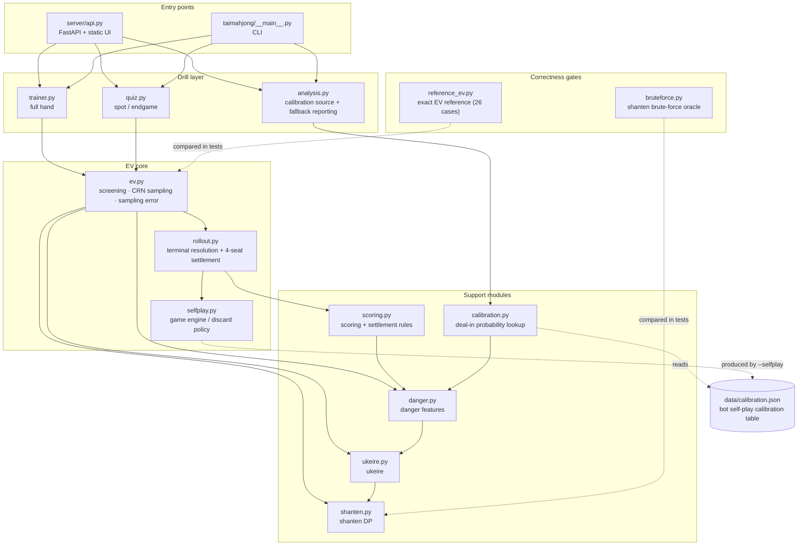

> 🌐 [繁體中文](README.md) ｜ **English**

# Taiwanese Mahjong Heuristic-EV Trainer

[](../../actions/workflows/tests.yml)
[](pyproject.toml)
[](LICENSE)

**Play a hand of Taiwanese 16-tile mahjong; every discard is scored by Monte Carlo terminal
rollouts — and the engine says so out loud when it cannot tell two discards apart.**


That is the screen after one played discard. The engine does not merely say "wrong move." It says:
this is 0.44 net EV behind the model's own top choice — and, by the way, the paired difference
between 9p and 7p is +0.04 with a descriptive interval of `[-0.53, +0.61]` spanning zero, so
**under the current simulation budget the model cannot separate them**. Reporting its own
unresolved rankings is the part of this project that took the most work.

## Three technical points

**1. Shanten by DP, not brute force.** Hands are held in a base-5 suit encoding, each suit's
feasible decompositions are packed into a bitset, and a memoized suit-profile composition replaces
the cartesian merge across suits ([`taimahjong/shanten.py`](taimahjong/shanten.py)). Correctness is
pinned by an independent brute-force oracle: 50,000 seeded random hands plus an exhaustive sweep of
*every* single-suit shape ([`tests/test_shanten_optimized.py`](tests/test_shanten_optimized.py)).

**2. EV is a common-random-numbers terminal simulation, not a formula.** Every candidate discard
shares the same sampled hidden worlds and random streams, each trial resolves to exactly one
mutually exclusive terminal outcome, and the house rules settle all four seats zero-sum. Confidence
-bound candidate screening and sampling-error estimates mean that when a ranking will not separate,
it is flagged unresolved rather than forced ([`taimahjong/ev.py`](taimahjong/ev.py) →
[`taimahjong/rollout.py`](taimahjong/rollout.py)).

**3. There is an independent ruler measuring the model.** `reference_ev` is a 26-case stratified
small-wall corpus where terminal probabilities can be computed exactly, used to measure the
production EV's MAE, top-1 agreement, ranking inversions, regret, and rank correlation
([`taimahjong/reference_ev.py`](taimahjong/reference_ev.py),
[`docs/ev-reference-report.md`](docs/ev-reference-report.md)). "How accurate is this estimate" is a
question with a number attached in this repo, not an adjective.

## What it honestly is not

It only handles the 34 ordinary tile kinds (characters, dots, bamboo, honors) — no flowers, no
special hands. The EV rollout models self-draws, ron wins, and draws for both the player and
opponents. Its ron-probability lookup is calibrated from built-in-bot self-play, while hidden hands
and future policies include heuristic assumptions. None is calibrated to human play, and a missing
lookup table is reported as a heuristic fallback. The tool is useful for practicing judgment, but
its numbers are not exact real-table win rates or exact EVs. The full four-way split is in the
[methodology card](#methodology-card) below.

Tiles use a compact notation: digits before a suit — `m` characters, `p` dots,
`s` bamboo, `z` honors (1–7). For example `123m456p789s1122334z` is 16 tiles.

## Quick start

**Web UI (recommended):**

```bash
pip install -r requirements.txt
uvicorn server.api:app
# open http://127.0.0.1:8000/
```

**Command line:** each feature runs on its own; examples are in the sections below.

**Tests (for developers):**

```bash
python3 -m pip install -r requirements-dev.txt
python3 -m pytest -q              # 269 tests, about 2.5 minutes
python3 -m pytest -q -m slow      # 14 exhaustive-oracle and large-sample tests, about 15 minutes
```

The slow batch is marked `slow` and excluded from the default run — brute-force oracle sweeps and
statistical tests that need large trial counts to have any power; the single-suit shape sweep alone
is 7.5 minutes. CI runs the fast batch on every push (Python 3.10 and 3.13) and the slow batch on a
nightly schedule.

The split shortens push-time feedback, not total machine time: run separately the two batches add
up to more than the combined run, because the `_cached_shanten` warm-up that the whole suite used
to amortise is now paid twice.

## Architecture



The calibration table feeds itself: `selfplay.py` runs bot self-play to produce
`data/calibration.json`, and `calibration.py` reads it back for the production rollout. That is
exactly why the calibration domain covers only the built-in bots — there is no human anywhere in
this loop.

---

## Features

### Hand efficiency: shanten and ukeire

Tells you how far a hand is from winning and which draws improve it.

"Shanten" is how many useful tiles you are away from tenpai — 0 means you're already
waiting. "Ukeire" (acceptance) is the set of tiles that bring you closer to a win. Give
it a 16-tile hand and it lists every acceptance tile plus how many of each are still
unseen (the math is simple: `4 − copies in hand − copies seen elsewhere`). Give it a
17-tile hand (drawn, not yet discarded) and it ranks every discard: lowest resulting
shanten first, then most acceptance.

If you've already called tiles, tell it with `--melds` (each call removes 3 concealed
tiles). Use `--visible` to factor in tiles you've seen elsewhere.

```bash
python3 -m taimahjong "123m123p123s1112223z" --ukeire     # list acceptance
python3 -m taimahjong "123m123p123s11122233z" --analyze   # rank discards
```

### Win-rate simulation

Estimates how soon you'll win using the "deal many hands" method (Monte Carlo).

It randomly deals many games against the 136-tile set, drawing without replacement, and
whenever it draws a non-winning tile it follows a heuristic efficiency discard and continues. It then reports
your cumulative tenpai and self-draw win rates after each turn. This standalone
`--simulate` mode counts your own self-draw only — it ignores opponents and deal-ins;
it is not the four-seat terminal rollout used by `--ev` below.

```bash
python3 -m taimahjong "123m123p123s1112223z" --simulate --turns 10 --sims 5000 --seed 42
```

### Deal-in danger and hand reading

Estimates how risky it is to discard a tile against an opponent, and reads their state.

It lists the tenpai shapes that could win on that tile, checks whether the tiles the
opponent would need still exist in the wall, and sums the feasible ones. It reads the
opponent's river: a suit they've discarded a lot of is treated as one they don't need, a
suit they've never discarded as one they might be waiting on; it also notices calls
concentrated in a single suit (going for a flush). Shape weights look like this:

| Shape | Weight |
| --- | --- |
| two-sided sequence | 4.0 |
| closed / edge sequence, pair-pair | 2.0 |
| single-tile wait | 1.0 |

Note: this is **not** a safety guarantee. Taiwanese mahjong has no permanent Japanese
riichi furiten, only temporary 過水, so a tile seen in the river only *discounts* the
danger — it never becomes 100% safe.

It also reads the opponent: `tenpai_score` estimates how close they are to waiting (more
calls means more likely tenpai), and `fold_score` judges whether they're folding
(bailing out, discarding only safe tiles). It also supports the house-rule **migi
declaration** — once an opponent declares, any tile kind they discard afterward cannot be
part of their win, which is a hard rule that marks it safe.

```bash
python3 -m taimahjong "123m123p123s11122233z" --danger --opp-river "456m789p" --tile "3z"
```

It prints the discard order with a separate `Danger` column, but does **not** merge
efficiency and danger into one score — you weigh them yourself.

### Scoring (tai)

Give it a winning hand and it scores it, item by item.

The project defaults to the following tai and house-rule choices: dealer 1,
連N拉N is 2N, 門清/自摸/獨聽 1, 平胡/全求人/三暗刻 2, 碰碰胡/混一色/小三元 4, 四暗刻 5,
清一色/大三元/小四喜/五暗刻 8, 字一色/大四喜 16, 圈風/門風/三元牌刻 1. One 底 equals
3 tai. 天胡/地胡 are 16/8 tai. It enumerates every way to read the hand and takes the
highest-scoring one.

A few documented house-rule calls:

- A **kong** scores no tai by itself. Only winning on a kong's replacement tile
  (槓上開花) and robbing a kong (搶槓) score, 1 tai each. A 大明槓 is actually bad here
  (no tai, breaks 門清, and forfeits 槓上開花).
- **全求人** uses the mainstream Taiwanese reading: a 大明槓 counts as a set completed
  from others' tiles and qualifies, but any 暗槓 disqualifies it. **Change this if your
  table rules differently.**
- The **連莊** premium applies to every payment leg between the dealer and the winner;
  even at streak 0, the leg paid to the dealer is one unit dearer than a peer's.
- If multiple players can ron one discard, the default awards the nearest downstream
  seat. Set `RulesConfig.multi_ron="all"` for 一炮多響; the discarder pays each winner.

```bash
python3 -m taimahjong "22z" --score --my-melds "123m;456p;789s;111z;555z" \
  --win-tile 2z --dealer --streak 2 --migi
```

### EV-based decisions

Turns "which discard is best" into a number you can compare.

EV is expected value. For each candidate discard, production EV samples four-seat hidden
states and a wall, then lets all four seats draw and discard under the model until one
mutually exclusive terminal occurs: player tsumo, player ron, opponent ron, opponent tsumo,
or draw. That terminal is settled as signed four-seat payments under the selected rules;
`net_ev` is the player's mean sampled payment, and the highest is **this model's estimated
best play**. The displayed attack and risk EVs are diagnostics split from those same terminal
payments, not separate estimates recombined to produce `net_ev`.

```bash
python3 -m taimahjong "123m123p123s11122233z" --ev --opp-river "1m2m" --opp-declared 0 --turns 3
```

The same output in the web UI:


Every candidate carries a 95% CI and its sample count. The top two are marked `≈` because the
interval on their paired difference spans zero — the engine's position is "these two cannot be
separated at this budget," not a confident pick. The `sha256:` string is the content hash of the
calibration table used for this run; swapping the table changes the id, so a result can always be
traced back to the version that produced it.

There's also a "should I declare migi?" feature (`--declare`): it computes the exact
probability of the locked wait after declaring versus a simulation of the normal style
(where you can still upgrade to a bigger hand), and compares which has higher EV.

### Teaching quiz

Turns games into one discard problem at a time.

It picks discriminating positions from self-play (not too easy; best and second-best must
differ by enough tai) and shows you only what your seat can see. You pick a tile and it
grades you immediately — best / good / inaccuracy / mistake — and uses an EV table to
explain why, whether it was the win-EV gap or the deal-in-loss gap. The same seed always
gives the same problem, handy for re-drilling or checking answers.

```bash
python3 -m taimahjong --quiz --seed 1 --answer 9s
python3 -m taimahjong --quiz-batch 5 --seed 1
```

### Live trainer

Plays a whole hand start to finish with you, scoring every move live.

It pauses when it's your turn, grades your discard by EV as you go, and tallies your
model-best rate and total EV loss until a win / deal-in / draw, then summarizes. In this phase
you play 門清 (self-draw or ron; no chi/pon yet) while opponents call normally. You can
pick a seat and streak at the start to feel different positions relative to the dealer —
a streak raises both the value of the dealer's win and the cost of dealing into them.

### Web teaching UI

If you'd rather not use the command line, use the web page.

A single-page app (no build step, just open it) that bundles the features into an easy
interface: full game (play to the end with live EV grading), single hand (one discard
problem), endgame (high-pressure spots as the wall runs low, auto-tagged attack/defense),
a lessons area (hand-written efficiency problems backed by pure acceptance), discard
analysis, and scoring. The table is drawn as a Mahjong-Soul-style cross-shaped river,
with analysis-tool-style feedback (verdict badge, EV delta, model-recommendation marker, expandable
ranking table). Answer history is stored in your browser, and the home page charts each
mode's model-best-rate trend.

The page can also switch the **底/台 scheme** (底3台1 ⇄ 底5台2). The 底:台 ratio changes
the trade-off between "win first" and "go for a big hand," so it can change the best
discard — switching re-scores instantly.

### Under the hood: how the engine is calibrated

The deal-in lookup is not set by hand — it is calibrated within the bot domain from self-play.

`taimahjong.selfplay` plays four bots against each other for thousands of games, records
the state and deal-in outcome of each discard, and builds probability tables from it (for
example, a "higher danger score → higher actual deal-in rate" lookup). Danger started as
just a relative score; this step turns it into a readable percentage. The calibration
data lives in `data/calibration.json` and you can rebuild or extend it:

```bash
python3 -m taimahjong --selfplay --games 250 --seed 10001 --out data/calibration.json
python3 -m taimahjong --selfplay-report data/calibration.json
```

The table maps each discard's per-opponent `danger_score` to a ron probability, and the
production rollout uses it on the opening and later discards. Again: only this ron/deal-in
probability lookup is calibrated against *these bots*. Self-draw and wall outcomes come from
Monte Carlo, while hidden hands and future policies include heuristics; none is calibrated
against humans.

### Methodology card

**Outcomes**: every EV rollout trial lands on exactly one of five mutually exclusive terminal
outcomes — `self_tsumo`, `self_ron`, `opponent_ron`, `opponent_tsumo`, `draw`; the draw payment is
currently fixed at zero. The table below splits the model by *how* each piece is actually produced.

| Category | What the project actually does | Limitation |
| --- | --- | --- |
| **Modeled and calculated exactly** | Given one sampled four-seat world, it validates ordinary-tile wins, scores the selected house rules, and performs zero-sum four-seat settlement. Each trial produces exactly one of `self_tsumo`, `self_ron`, `opponent_ron`, `opponent_tsumo`, or `draw`; `net_ev` is exactly the acting seat's mean sampled terminal payment. | “Exact” covers rules, settlement, and aggregation inside that sampled world—not exact terminal probabilities or human play. Draw payment is currently fixed at zero. |
| **Heuristic approximation** | Public information drives opponent-tenpai estimates and hidden-hand sampling; efficiency-discard and fixed defense policies advance future play. Wall and terminal frequencies are fixed-seed Monte Carlo estimates. | Opponents do not fully adapt; the hidden-world distribution and policies are model assumptions, and finite sampling leaves error. |
| **Calibrated by a calibration table** | The per-opponent `danger_score` lookup supplies ron/deal-in probabilities on the opening and later discards. Its domain is the built-in-bot self-play ecology. | It is not calibrated on human games. If a calibrated event conflicts with the sampled concealed hand, a physically winning hand is redeterminized for valuation. If no usable calibration table is available, a reported heuristic fallback is used. |
| **Not modeled** | Future chi, pon, kong/replacement draws and flowers, special hands, complete pass-on-ron decisions, and a full best response by every seat. | These events are absent from the terminal rollout transitions; draws also have no tenpai/noten settlement. |

**Calibration domain**: only the ron/deal-in probability lookup is calibrated, and its domain is
the built-in-bot self-play ecology, not human game records. When no usable calibration table is
available, all three teaching paths fall back to the same heuristic and report that they did.

**Sampling uncertainty**: production EV is a fixed-seed Monte Carlo point estimate; boundary drills add samples and expose uncertainty, but residual error remains. The locked-wait self-draw probability in `--declare` is exact only within its simplified unseen-pool hypergeometric model; survival against opponents is still heuristic.

**Claim review checklist**: `[x]` the model-engineering owner confirmed this page describes its
outputs only as model estimates / heuristic EV (Batch A, 2026-07-23). `[ ]` this card was rewritten
on 2026-08-11 to match the terminal-rollout implementation; the four-category split is still
awaiting owner re-confirmation.

### Research experiments

Two small research scripts use paired-seed self-play to answer strategy questions:
seat-by-seat defense against a streaking dealer (`scripts/streak_defense.py`) and whether
each kong type is worth declaring (`scripts/kong_ev.py`). Method and data are in
[docs/experiments.md](docs/experiments.md).

---

## Honest scope and limits

- **Ordinary tiles only**: no flowers, no special hands.
- **Only the ron/deal-in probability lookup has bot-domain calibration**, not human calibration;
  self-draw and wall outcomes are Monte Carlo, while hidden hands, opponent discards, and
  defense policies include heuristic assumptions.
- **Danger is not a safety guarantee**: Taiwan has no permanent furiten, so river
  evidence only discounts.
- **House rules are adjustable**: how 全求人 counts, kong tai, whether a draw is
  penalized (`DRAW_VALUE`), and the 底/台 scheme are all constants or options you can
  change for your table.

Technical details (parameters, full calibration data, tai-stacking rules) live in each
module's docstrings and in [docs/experiments.md](docs/experiments.md).
