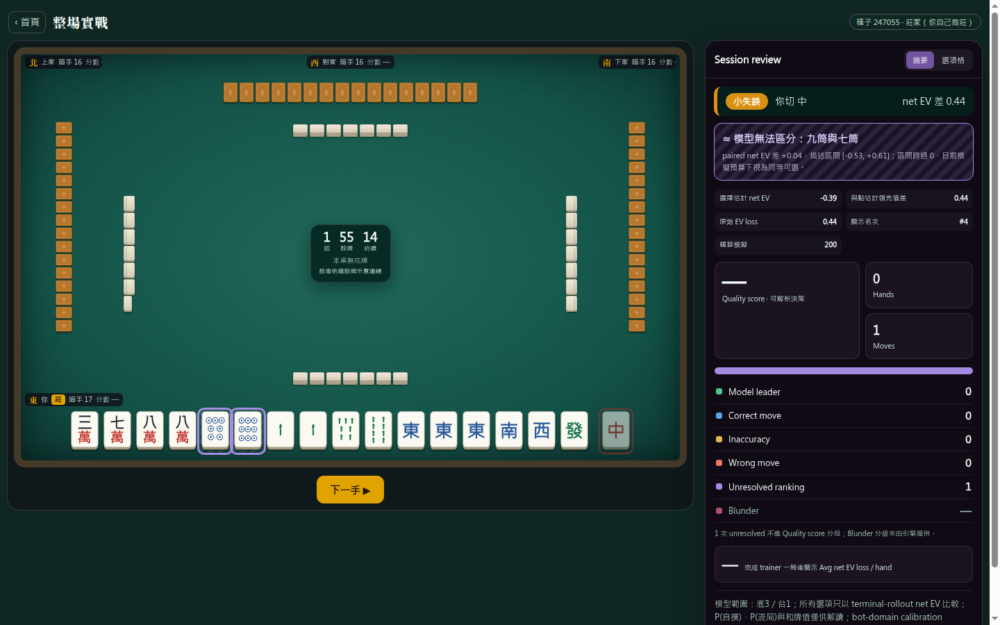
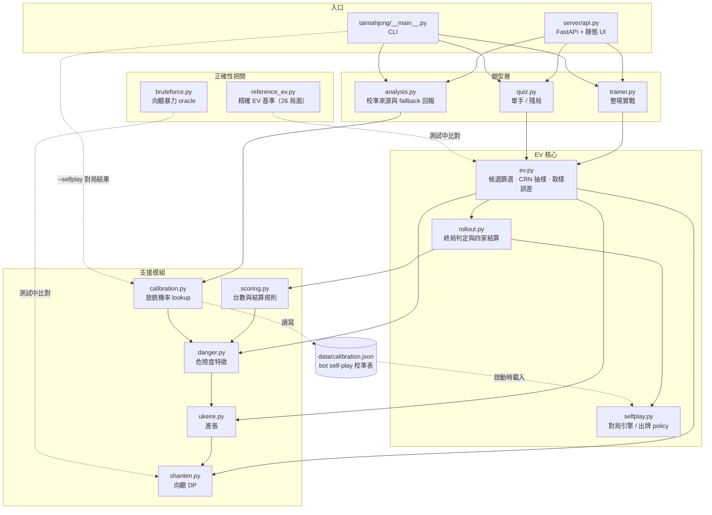
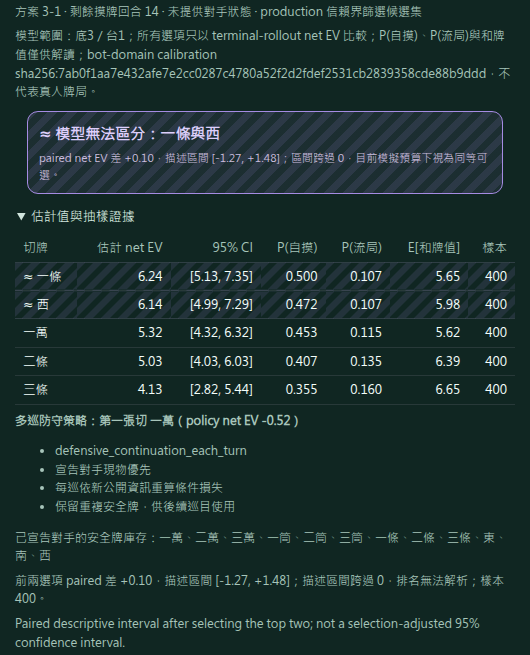

> 🌐 **繁體中文** ｜ [English](README.en.md)

# 台灣麻將 heuristic EV 訓練器

[](../../actions/workflows/tests.yml)
[](pyproject.toml)
[](LICENSE)

**一局台灣十六張麻將，每一次切牌都用蒙地卡羅終局 rollout 打分，並在模型分不出高下時直說。**



上圖是打完一手之後的畫面。引擎不只說「你切錯了」，它說的是：這手比模型的首選差 0.44 net EV；
順帶一提，九筒和七筒之間 paired 差為 +0.04、描述區間 `[-0.53, +0.61]` 跨過 0，**在目前的模擬
預算下模型分不出這兩張誰好**。會主動報告自己分不出來的排名，是這個專案最花力氣的部分。

## 三個技術重點

**1. 向聽數 DP，不是暴力搜尋。** 手牌以 base-5 suit encoding 表示，各花色的可行拆解結果存成
bitset，再用 memoized suit-profile composition 取代跨花色的笛卡兒積合併
（[`taimahjong/shanten.py`](taimahjong/shanten.py)）。正確性由一個獨立的暴力 oracle 把關：
50,000 個生成的胡牌／差一張的牌型（涵蓋所有副露數與兩種手牌長度），加上所有每種牌不超過 3 張的
合法單花色 shape 窮舉比對（[`tests/test_shanten_optimized.py`](tests/test_shanten_optimized.py)）。

**2. EV 是共用亂數的終局模擬，不是公式拼裝。** 所有候選切牌共用同一批抽樣的隱藏世界與亂數流
（common random numbers），每次 trial 只落在一個互斥終局上，再依家規做四家零和結算；搭配信賴
界線候選篩選與取樣誤差估計，排名分不開時就標記為 unresolved 而不是硬排
（[`taimahjong/ev.py`](taimahjong/ev.py) → [`taimahjong/rollout.py`](taimahjong/rollout.py)）。

**3. 有一把獨立的尺在量這個模型。** `reference_ev` 是一組 26 個分層抽樣的小牌牆局面，可以把終局
機率算到精確值，用來量測 production EV 的 MAE、top-1 一致率、排名倒轉、regret 與等級相關係數
（[`taimahjong/reference_ev.py`](taimahjong/reference_ev.py)）。目前 production 在這組語料上
top-1 一致率 100%、排名倒轉率 0%，而且在預設取樣預算下誤差**恰好為 0** —— 因為 ≤4 張的牌牆會被
窮舉排列而非抽樣，24 次剛好走完 4! 種順序。有趣的是把預算加到 1000 次反而讓誤差變成 0.0126，那
不是雜訊而是排列配重不均；完整說明見
[`docs/ev-reference-report.md`](docs/ev-reference-report.md)。換句話說，「這個估計值有多準」
在這個 repo 裡是一個有數字、而且解釋得出來的問題。

## 老實說它不是什麼

只處理 34 種普通牌（萬、筒、條、字），不做花牌，也不算特殊牌型。EV rollout 會模擬自己與對手的
自摸、榮和及流局；其中榮和機率的 lookup table 來自內建機器人自我對局，隱藏手牌與各家後續策略
則含 heuristic 假設。這些都不是對真人牌局的校準，缺少 lookup table 時還會明示改用 heuristic
fallback。因此它適合拿來練判斷、練手感，但別把數字當成真人牌桌上的精準勝率或精準 EV。
完整的四類拆解在下面的[方法論卡](#方法論卡)。

牌的寫法用簡寫：數字寫在花色前面，`m` 萬、`p` 筒、`s` 條、`z` 字牌（1–7）。例如
`123m456p789s1122334z` 就是 16 張。

## 快速開始

**用網頁介面（推薦）：**

```bash
pip install -r requirements.txt
uvicorn server.api:app
# 開瀏覽器到 http://127.0.0.1:8000/
```

**用命令列：** 每個功能都能單獨跑，例子在下面各段。

**跑測試（給開發者）：**

```bash
python3 -m pip install -r requirements-dev.txt
python3 -m pytest -q              # 269 個測試，約 2 分半
python3 -m pytest -q -m slow      # 14 個窮舉 oracle 與大樣本統計測試，約 15 分鐘
```

慢的那批標成 `slow` 並從預設執行中排除——它們是暴力 oracle 全掃描與需要大量 trial 才有檢定力的
統計測試，光是單一花色 shape 的窮舉比對就佔 7 分半。CI 每次 push 跑快的那批（Python 3.10 與
3.13），慢的那批走每日排程。

拆分的目的是縮短 push 當下的回饋時間，不是縮短總時數：兩批分開跑的總和其實比合併跑更久，因為
`_cached_shanten` 的暖機成本原本由整套共同攤提，拆開後兩邊各付一次。

## 架構



校準表是**自己餵自己**的：`--selfplay` 跑機器人自我對局，CLI 把結果交給
`calibration.write_merged_table` 寫成 `data/calibration.json`（`__main__.py:283`）；而
`selfplay.py` 自己又會在啟動時把這張 committed 的表載回來當預設危險度來源
（`selfplay.py:361` 的 `_default_calibration`）。所以這是一個真正的閉環——也正因如此，校準資料域
只涵蓋內建 bot，這條迴圈裡從頭到尾沒有真人。

---

## 功能一覽

### 牌效分析：向聽與進張

告訴你一手牌離胡還有多遠，以及摸到哪些牌會進步。

「向聽數」就是你離聽牌還差幾張有效牌，差 0 就是聽牌了。「進張」就是能讓你更接近
胡牌的那些牌。給它一手 16 張的牌，它會列出每一種進張、還有那種牌總共還剩幾張沒
出現（算法很簡單：`4 −（手上有幾張）−（別處看到幾張）`）。給它一手 17 張的牌
（摸完還沒切），它會幫你把每一種切牌排名：先看切完向聽誰小，一樣再比進張誰多。

如果你已經吃碰亮牌，用 `--melds` 告訴它，每一組會少算 3 張暗牌。用 `--visible`
可以把「你在別處看到的牌」也一起考慮進去。

```bash
python3 -m taimahjong "123m123p123s1112223z" --ukeire     # 列進張
python3 -m taimahjong "123m123p123s11122233z" --analyze   # 切牌排名
```

### 胡牌率模擬

用「發很多次牌」的方法（蒙地卡羅模擬）估你大概多久會胡。

它對著 136 張牌隨機發很多局，每局抽了就不放回，抽到不能胡的牌就照 heuristic 牌效切牌繼續
打，最後告訴你：每摸一巡之後，累積的聽牌率和自摸胡牌率各是多少。這個獨立的
`--simulate` 模式只算你自己摸牌自摸，不管對手怎麼打、不管放槍；它不是下文
`--ev` 使用的四家終局 rollout。

```bash
python3 -m taimahjong "123m123p123s1112223z" --simulate --turns 10 --sims 5000 --seed 42
```

### 放槍危險度與讀牌

估切某張牌給某個對手，放槍的風險有多高，並幫你讀對手大概什麼狀態。

它的做法是：把「靠這張牌就能胡」的各種聽牌型列出來，看看對手需要的牌還在不在
牌牆裡，再把做得到的那些型加起來。它會參考對手的牌河：某門切了很多就當他不缺、
某門完全沒切就當他可能等那門；還會看副露是不是集中在同一花色（做清一色的樣子）。
不同牌型的權重像這樣：

| 牌型 | 權重 |
| --- | --- |
| 兩面順 | 4.0 |
| 崁張／邊張／對碰 | 2.0 |
| 單騎 | 1.0 |

要提醒的是：這**不是**保證安全的工具。台灣麻將沒有日本立直那種「永久振聽」，只有
暫時的過水，所以牌河出現過的牌只會讓危險「打折」，不會變成 100% 安全。

它也會幫你讀對手：`tenpai_score` 估他多接近聽牌（鳴牌越多、越可能聽）；`fold_score`
判斷他是不是在蓋牌（不打了、只切安全牌）。還支援家規 **migi 宣告**——一旦對手宣告，
他之後切出的任何一種牌都不可能是他要胡的，這是硬規則，直接標成安全。

```bash
python3 -m taimahjong "123m123p123s11122233z" --danger --opp-river "456m789p" --tile "3z"
```

它會照切牌順序印出來，另外多一欄 `Danger`，但**不會**把效率和危險混成一個分數，讓
你自己權衡。

### 台數計分

給一副胡牌，逐項幫你算台。

本專案預設採下列台數與家規：莊 1、連 N 拉 N 是 2N、門清／自摸／獨聽 1、
平胡／全求人／三暗刻 2、碰碰胡／混一色／小三元 4、四暗刻 5、清一色／大三元／
小四喜／五暗刻 8、字一色／大四喜 16、圈風／門風／三元牌刻 1。一底等於 3 台。天胡／
地胡是 16／8 台。它會把所有胡牌拆法都試過，取台數最高的那種算給你。

幾條有記錄的家規判斷：

- **槓**本身不計台。只有胡在槓補上來的牌（槓上開花）和搶槓各算 1 台。大明槓其實
  是虧的（不計台、又破門清、還放棄槓上開花）。
- **全求人**採台灣最常見的解釋：大明槓算一組「靠別人湊成」的面子、可以算，但只要
  有暗槓就不算。**如果你的牌桌規則不一樣，這裡可以改。**
- **連莊**的加成會套在莊家和胡家之間的每一筆付款上，就算連莊 0，付給莊的那筆也
  比一般貴一單位。
- 同一張牌多人可胡時，預設由放槍者下家起算最近者胡；**一炮多響**可透過
  `RulesConfig.multi_ron="all"` 啟用，放槍者分別支付每位胡家。

```bash
python3 -m taimahjong "22z" --score --my-melds "123m;456p;789s;111z;555z" \
  --win-tile 2z --dealer --streak 2 --migi
```

### 用 EV 幫你做決定

把「切哪張最好」變成一個可以比較的數字。

EV 就是期望值。production EV 會為每種候選切牌抽樣四家隱藏狀態與牌牆，讓四家依模型
策略輪流摸切，直到出現一個互斥終局：自己自摸、自己榮和、對手榮和、對手自摸或流局。
每次終局都按家規結算四家的正負 payment；`net_ev` 是自己 payment 的樣本平均，數字最高的
是**本模型估計最佳**的一手。介面上的進攻 EV 與風險 EV 是同一批終局 payment 拆出的診斷量，
不是另外估完再拼成 `net_ev`。

```bash
python3 -m taimahjong "123m123p123s11122233z" --ev --opp-river "1m2m" --opp-declared 0 --turns 3
```

網頁上的同一份輸出長這樣：



每個候選都附 95% CI 與樣本數，最上面兩個掛著 `≈` 是因為它們的 paired 差區間跨過 0——引擎的
立場是「這兩張在目前預算下分不出來」，而不是挑一個假裝有把握。畫面上那串 `sha256:` 是這次用到
的校準表 content hash，換表會換 id，方便回頭對照結果是哪一版算出來的。

另外有個「要不要宣告 migi」的功能（`--declare`）：一邊算「宣告後鎖聽、直接等」的
機率，一邊模擬「不宣告、還有機會換大牌」的打法，幫你比哪個 EV 高。

### 教學測驗

把牌局變成一題一題的切牌練習。

它從自對局裡挑出「有鑑別度」的局面（不會太簡單、最佳和次佳要差夠多台），只保留你
這家看得到的資訊出題。你選一張，它馬上判定：最佳／不錯／小失誤／失誤，並用 EV 表
告訴你為什麼——是胡牌 EV 的差、還是放槍損失的差。同一個種子每次出同一題，方便重
練或對答案。

```bash
python3 -m taimahjong --quiz --seed 1 --answer 9s
python3 -m taimahjong --quiz-batch 5 --seed 1
```

### 實戰訓練器

陪你把「一整局」從頭打到尾，每一手都即時打分。

輪到你切牌就暫停，你選完馬上給 EV 判定，並累計你的模型最佳率和總 EV 損失，一直打到胡／
放槍／流局再給總結。目前這一階段你打門清（可以自摸、榮和，暫時不能吃碰），對手會
正常鳴牌。開局可以選座位和連莊數，體會坐在莊的不同相對位置——連莊會同時拉高「胡莊
的價值」和「放槍給莊的代價」。

### Web 教學介面

不想記命令列，就用網頁。

一個單頁應用（不用建置，開了就能用），把上面的功能整合成好操作的介面：整場（一局
打到底、每步即時 EV 評分）、單手（抽一題練切牌）、殘局（牌快摸完的高壓局面，自動
分進攻題或防守題）、教學區（手寫的基本牌效題，用純進張當場驗證）、切牌分析、算台。
牌桌畫成雀魂那種十字河，回饋採分析工具風格（判定徽章、EV 差、標示模型建議、
可展開的排名表）。作答紀錄存在瀏覽器裡，首頁畫每個模式的模型最佳率走勢。

網頁上還能切換**底/台方案**（底3台1 ⇄ 底5台2）。底和台的比例會改變「先求胡」還是
「拚大牌」的取捨，所以有時本模型估計的切牌也跟著變——切換就即時重新打分。

### 底層：引擎怎麼校準

放銃率表不是憑空設定，而是靠自對局在 bot domain 內校準出來的。

`taimahjong.selfplay` 讓四個機器人對打幾千局，把每次切牌的狀態、有沒有放槍等資料
記下來，整理成幾張機率表（例如「危險分數越高、實際放槍率越高」的對照表）。危險度
本來只是相對高低，經過這一步才變成可以看的百分比。校準資料存在 `data/calibration.json`，
可以自己重跑加料：

```bash
python3 -m taimahjong --selfplay --games 250 --seed 10001 --out data/calibration.json
python3 -m taimahjong --selfplay-report data/calibration.json
```

這張表把每次切牌對每位對手的 `danger_score` 映射成榮和機率，production rollout 會在
當下及後續每次切牌使用它。再強調一次：只有這個 RON／放銃機率 lookup 對「這些機器人」
校準；自摸與牌牆結果來自 Monte Carlo，隱藏手牌及後續策略含 heuristic 假設，更不是對真人。

### 方法論卡

**Outcomes**：EV rollout 的每次 trial 恰好落在五種互斥終局之一——`self_tsumo`（自己自摸）、
`self_ron`（自己榮和）、`opponent_ron`（對手榮和）、`opponent_tsumo`（對手自摸）、`draw`（流局）；
流局 payment 目前固定為 0。下表按「這個項目怎麼算出來的」把模型拆成四類。

| 類別 | 本專案實際處理 | 限制 |
| --- | --- | --- |
| **已建模且精確計算** | 給定一個已抽樣的四家世界後，檢查普通牌胡型，依選定家規計台並做四家零和結算；每次 trial 只會產生 `self_tsumo`、`self_ron`、`opponent_ron`、`opponent_tsumo`、`draw` 之一，`net_ev` 精確等於 acting seat 的 terminal payments 樣本平均。 | 「精確」只指該抽樣世界內的規則、結算與 aggregation，不代表終局機率或真人打法精確。流局 payment 目前固定為 0。 |
| **以 heuristic 近似** | 依公開資訊估對手聽牌、抽樣隱藏手牌，並用牌效出牌與固定防守 policy 推進後續牌局；牌牆與終局頻率用 fixed-seed Monte Carlo 估計。 | 對手不會做完整策略調整；隱藏世界分布與 policy 都是模型假設，有限樣本仍有誤差。 |
| **由 calibration table 校準** | RON／放銃機率由 `danger_score` 的 per-opponent lookup 提供，套用於當下與後續各次切牌。資料來自內建 bot self-play 的 bot ecology。 | 不是人類牌譜校準；校準事件若與抽到的暗手衝突，會重建一個可胡的實體手牌來估值。缺少可用的 calibration table 時改用 heuristic fallback 並回報。 |
| **未建模** | EV rollout 中未來的吃、碰、槓／補牌與花牌、特殊牌型、完整過水決策，以及各家完整 best response。 | 這些事件不在 terminal rollout 的狀態轉移中；流局也沒有聽牌／未聽罰付。 |

**Calibration domain**：只有 RON／放銃機率 lookup 經過校準，且校準來源是內建 bot self-play 的
bot ecology，不是人類牌譜。缺少可用的 calibration table 時，三條教學路徑一致改用 heuristic
fallback 並在輸出中回報。

**Sampling uncertainty**：production EV 是 fixed-seed Monte Carlo 點估計；邊界題會加樣並顯示不確定性，仍有殘餘誤差。`--declare` 的鎖聽自摸機率是在其簡化未見牌池模型內用 hypergeometric 精確計算，但對手中途胡牌的 survival 仍是 heuristic。

**聲稱 review checklist**：`[x]` 模型工程 owner 已確認本頁只把輸出稱為本模型估計／heuristic EV
（Batch A，2026-07-23）。`[ ]` 本卡於 2026-08-11 依 terminal rollout 實作重寫，四類拆解尚待
owner 複核。

### 研究實驗

附了兩個小研究腳本，用配對種子的自對局回答策略問題：分座位怎麼防連莊的莊家
（`scripts/streak_defense.py`）、還有各種槓值不值得開（`scripts/kong_ev.py`）。方法
和數據在 [docs/experiments.md](docs/experiments.md)。

---

## 老實話（範圍與限制）

- **只做普通牌**：不含花牌、不含特殊牌型。
- **只有 RON／放銃機率 lookup 是 bot-domain calibration**，不是真人牌局；自摸與牌牆結果
  是 Monte Carlo，隱藏手牌、對手出牌與防守 policy 含 heuristic 假設。
- **危險度不保證安全**：台灣沒有永久振聽，牌河證據只是打折。
- **家規可改**：全求人怎麼算、槓的台數、流局要不要罰（`DRAW_VALUE`）、底台方案，
  都寫成常數或選項，牌桌規則不同時可以改。

技術細節（各參數、校準過程的完整數據、疊台規則）散在各模組的 docstring 和
[docs/experiments.md](docs/experiments.md) 裡。
